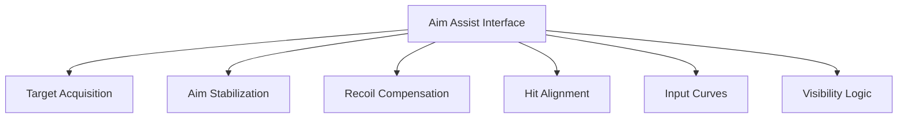

## Overview

The Midnight Walkers Aim Assist is a runtime targeting assistance system built to interface with combat mechanics in **The Midnight Walkers**. The system focuses on aiming precision rather than damage manipulation, exposing configurable layers for target acquisition, aim stabilization, recoil compensation, and hit probability alignment. Operating as a non-destructive runtime overlay, it applies real-time adjustments to aiming calculations without modifying core combat rules or progression data. Secondary keywords integrated include aim assist system, targeting helper, accuracy controller, and combat precision module.

---

## Target Acquisition and Lock Logic

* Nearest-threat prioritization
* Soft target lock within configurable radius
* Line-of-sight validation
* Target switch delay tuning

**Feature intent:**
Assists initial target selection by guiding aim toward valid hostile entities without enforcing hard locks.

---

## Aim Stabilization and Drift Reduction

* Crosshair sway suppression
* Camera shake reduction
* Movement-based aim correction
* ADS stability enhancement

**In-game behavior:**
Reduces involuntary aim deviation caused by movement, stress effects, or environmental feedback.

---

## Recoil and Weapon Kick Compensation

* Vertical recoil dampening
* Horizontal kick normalization
* Burst and automatic fire smoothing
* Weapon-specific recoil profiles

**Feature intent:**
Offsets recoil calculations to maintain consistent aiming alignment during sustained fire.

---

## Hit Alignment and Accuracy Assistance

* Minor aim magnetism toward hitboxes
* Distance-scaled correction strength
* Precision threshold enforcement
* Overcorrection prevention logic

**In-game behavior:**
Fine-tunes shot alignment at the moment of firing without altering projectile damage or behavior.

---

## Sensitivity and Input Curve Control

* Dynamic sensitivity scaling
* ADS vs hip-fire curve separation
* Acceleration and deceleration tuning
* Input smoothing filters

**Feature intent:**
Provides granular control over how raw input translates into camera movement during combat.

---

## Visibility-Aware Aim Adjustment

* Low-light compensation logic
* Partial obstruction filtering
* Target silhouette consistency handling
* Visual noise tolerance tuning

**In-game behavior:**
Improves aim consistency in dark or visually cluttered environments typical of survival horror gameplay.

---

## Aim Assist Interface and Controls

* Modular assistance toggles
* Real-time strength sliders
* Weapon-category presets
* Session-scoped configuration

**Feature intent:**
Acts as the central control surface, coordinating all aim-related assistance layers dynamically.

---

## Aiming System Architecture

---

## FAQ

**Does the aim assist change weapon damage?**
No, it only affects targeting and aiming calculations.

**Is target lock fully automatic?**
No, the system uses soft guidance rather than hard locking.

**Can recoil assistance be disabled independently?**
Yes, each aiming subsystem can be toggled separately.

**Does it work in low-visibility environments?**
Visibility-aware logic is specifically designed for dark and obstructed areas.

**Are settings applied instantly?**
Most adjustments take effect in real time.

**Is configuration saved between sessions?**
Settings apply per active session.

---

## Feature Summary

* Target acquisition and soft lock logic
* Aim stabilization and drift reduction
* Recoil and weapon kick compensation
* Hit alignment and accuracy assistance
* Sensitivity and input curve control
* Visibility-aware aim adjustment
* Centralized aim assist control interface
